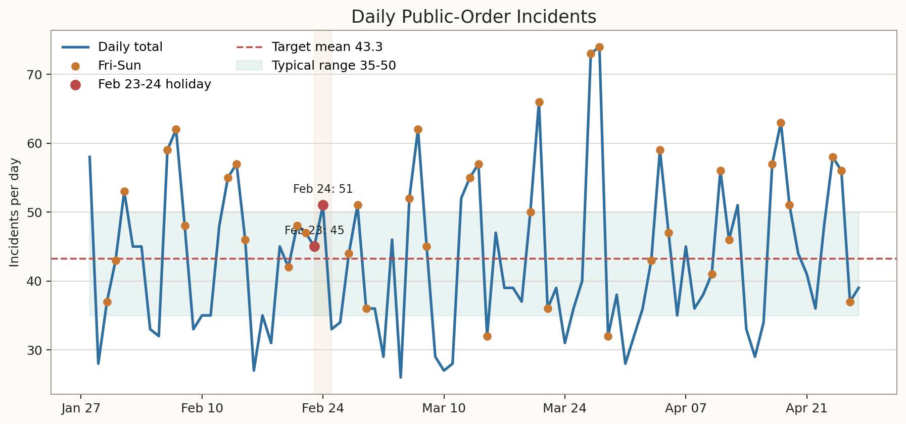
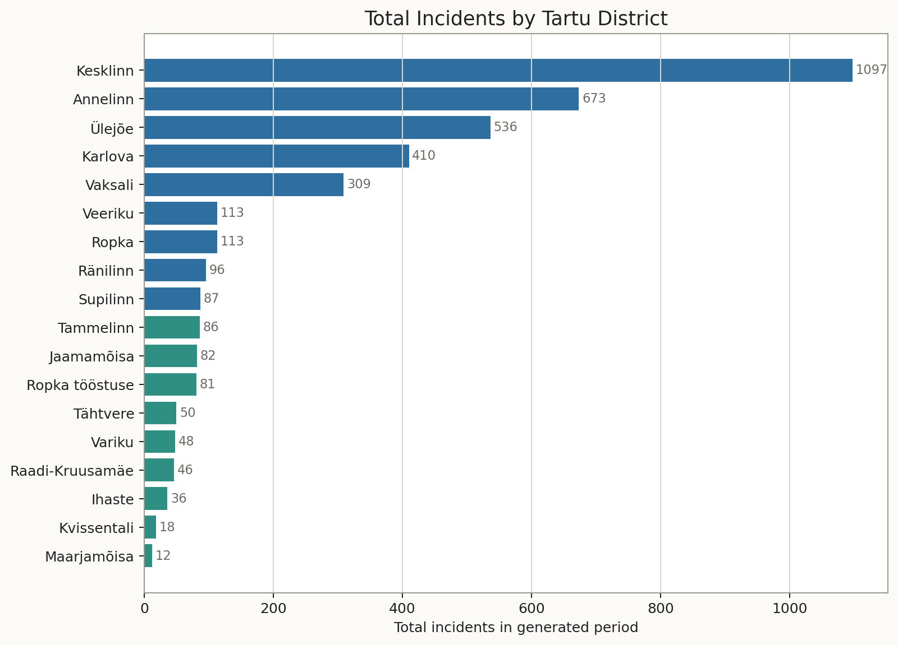
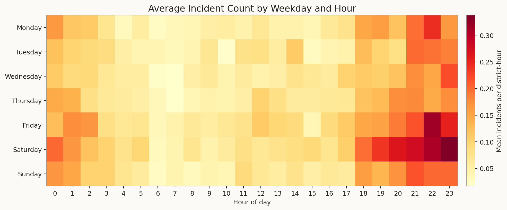
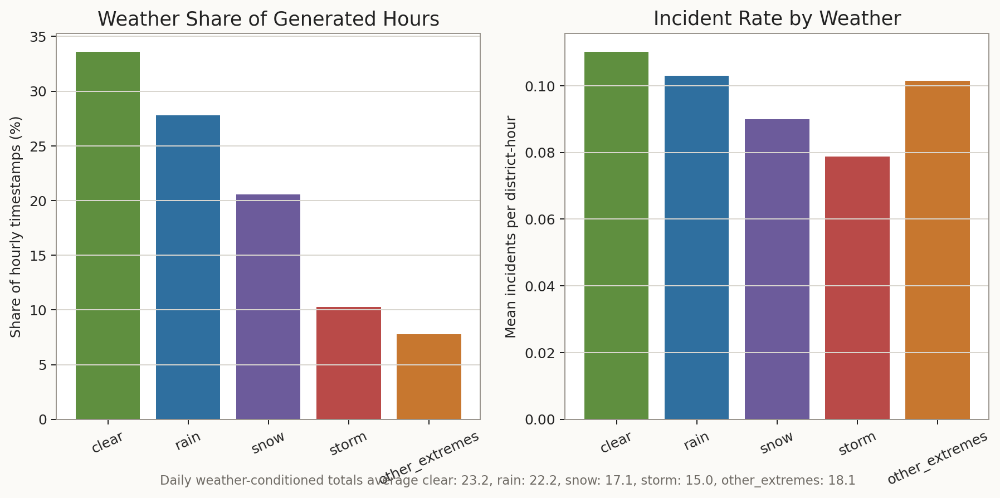
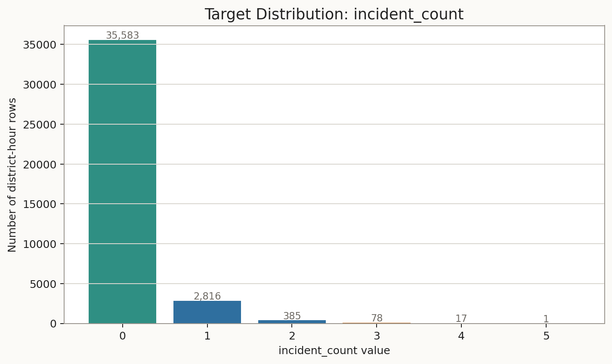
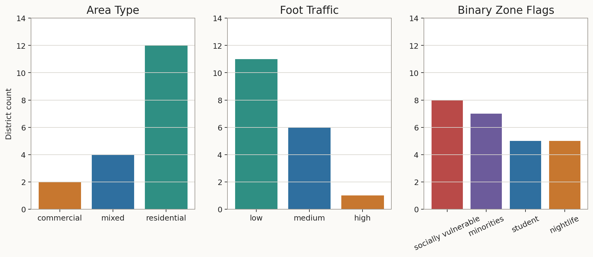

# Dataset Overview

This CSV is a synthetic hourly panel dataset for Tartu public-order incident
forecasting. One row is one district at one timestamp. The target is
`incident_count`; there is no `risk_score` and no `same_slot_avg_90d`.

## Basic Shape

- Rows: 38,880
- Columns: 18
- Districts: 18
- Hourly timestamps: 2,160
- Time range: 2026-01-28 00:00:00 to 2026-04-27 23:00:00
- Daily incident mean: 43.26
- Daily incident range: 26 to 84

## Columns

`id`, `area`, `time`, `population`, `area_km2`, `area_population_density`, `foot_traffic`, `area_type`, `socially_vulnerable_zone`, `minorities_zone`, `student_zone`, `nightlife_zone`, `day_of_week`, `hour`, `is_weekend`, `is_night`, `weather`, `incident_count`

## Target Behavior

- Zero rows: 91.63%
- Rows with exactly one incident: 7.12%
- Rows with two or more incidents: 1.25%
- Highest incident day: 2026-02-06 with 84 incidents
- Lowest incident day: 2026-03-05 with 26 incidents

The target is intentionally sparse: most district-hour combinations have no
incident, single incidents are occasional, and 2+ counts are uncommon.

## Strongest Aggregate Patterns

- Highest-total districts: Kesklinn (1208), Ülejõe (530), Karlova (443), Vaksali (365), Annelinn (305)
- Lowest-total districts: Raadi-Kruusamäe (57), Tähtvere (47), Variku (43), Kvissentali (33), Maarjamõisa (25)
- Weekday daily means: Monday 37.2, Tuesday 35.6, Wednesday 37.2, Thursday 39.3, Friday 44.5, Saturday 57.9, Sunday 50.5
- Weather mix: clear 33.6%, rain 27.8%, snow 20.6%, storm 10.3%, other_extremes 7.8%

## Visuals

